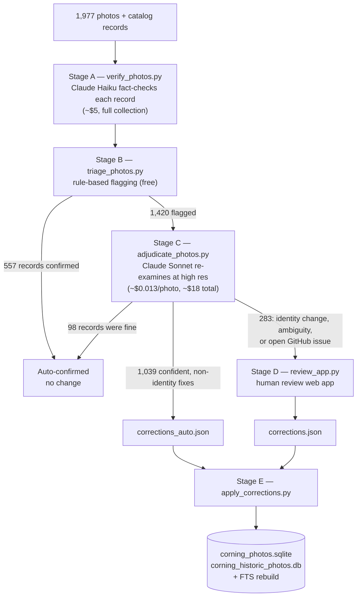

[](https://doi.org/10.5281/zenodo.19615586)

# Corning, NY Local History Photo Archive</br>AI-Assisted Cataloging

This project documents an effort to download, catalog, and enrich the [Corning, NY Local History Photo Archive](https://corningnyhistory.com/local-history-photo-archive/) using AI-generated image descriptions. The archive is maintained by the Southeast Steuben County Library and contains 1,977 digitized historical photographs spanning 1842 to 1975.

**In a hurry? Read the [TL;DR](TLDR.md).**

The goal is to improve the discoverability of these images by generating structured tags, one-sentence descriptions, and thematic category assignments for every photo, supplementing the library's existing (and often sparse) subject/date metadata.

You can directly interact with the enriched data using the [Datasette Lite URL](https://lite.datasette.io/?url=https://raw.githubusercontent.com/DaveKT/Corning-NY-Local-History-Photo-Archive/master/datasette/corning_historic_photos.db&metadata=https://raw.githubusercontent.com/DaveKT/Corning-NY-Local-History-Photo-Archive/master/datasette/metadata.yml#/corning_historic_photos/photo_catalog).

## Background

The Corning Local History Photo Archive is a digitized collection of photographs documenting the history of Corning, NY, and the surrounding Chemung Valley. The collection covers civic life, architecture, floods, industry (particularly Corning Glass Works), schools, families, archaeological artifacts, and more.

Before this project, the archive's catalog had significant gaps: 53% of records lacked any subject keyword and 70% lacked a date. Tags and date formatting were inconsistent across records. This project addresses those gaps by pairing each image with AI-generated descriptive metadata that can be reviewed, corrected, and incorporated into the library's catalog.

## How It Works

The original cataloging pipeline has four stages, each handled by a standalone Python script. (A fifth, multi-stage verification & correction pipeline, described in the next section, reviews and refines what these stages produce.)

### 1. Download
[scripts/download_archive.py](scripts/download_archive.py)

Scrapes the archive website and downloads all full-resolution images into a local `photos/` directory. Supports concurrent downloads with configurable thread count and per-request delay. Skips previously downloaded files, making it safe to re-run.

```
python scripts/download_archive.py --output-dir ./photos --workers 4 --delay 0.25
```

### 2. Image Cataloging
[scripts/image_catalog.py](scripts/image_catalog.py)

Scans the downloaded photos and produces a CSV of technical metadata: dimensions, file size, colorspace, and MD5/SHA-256 hashes. This is used for deduplication checks and to identify anomalies (e.g., unusual aspect ratios or unexpectedly small files).

```
python scripts/image_catalog.py ./photos --output data/image_attributes.csv
```

### 3. AI Description
[scripts/process_photos.py](scripts/process_photos.py)

Sends each image to Claude Haiku (via the OpenRouter API) along with any existing catalog metadata for context. The model returns 3-5 descriptive tags and a one-sentence description per image. Results are saved incrementally to a JSON file, making the process resumable if interrupted.

```
export OPENROUTER_API_KEY="your-key-here"
python scripts/process_photos.py
```

The script also merges the AI-generated tags and descriptions back into the master CSV index.

### 4. Category Classification
[scripts/classify_photos.py](scripts/classify_photos.py)

Assigns each photo exactly one of 14 thematic categories (e.g., Disasters & Floods, Industry & Manufacturing, Streetscapes & Architecture) using rule-based keyword matching against the Subject, Tags, and Description fields. A strict priority hierarchy resolves ambiguity when a photo matches more than one category. The classifier is deterministic and uses only standard-library modules.

```
python scripts/classify_photos.py data/corning_photos.sqlite --output data/photo_categories.csv
```

The output CSV is imported into both `data/corning_photos.sqlite` and `datasette/corning_historic_photos.db` as a `category` table. The full category schema, priority rules, edge-case decisions, and distribution are documented in `analysis/category_classification.md`.

## Verification & Correction Pipeline

The original AI descriptions contained errors — misidentified sports, objects, settings, and in some cases the gender or identity of people in the photos (documented as GitHub issues #1–#32). A second pipeline finds and corrects these errors with as little manual review as possible: models handle everything they can decide reliably, and a human is pulled in only for identity-related changes, genuinely ambiguous images, and photos with open GitHub issues. The pipeline was run over the full collection in July 2026 (results below) and remains re-runnable for future refinement cycles.



### Stage A — Verification
[scripts/verify_photos.py](scripts/verify_photos.py)

Sends each photo (downscaled to 1024px) plus its existing record to Claude Haiku with a fact-checking prompt: transcribe any visible caption (captions are authoritative), find contradictions between the record and the image, grade each error material or minor, and audit the assigned category against the 14-category schema. It does **not** rewrite records for style — a correction requires an enumerated error. Results are saved incrementally and the run is resumable.

```
python scripts/verify_photos.py --all
```

### Stage B — Triage
[scripts/triage_photos.py](scripts/triage_photos.py)

Free, deterministic flagging. A photo is flagged for: material errors, a category change (from the verifier's audit or from re-running the keyword classifier on corrected text), low verifier confidence, unsettled doubts, or lexicon rules covering the known failure modes (group-identity terms, risky object identifications, uncorroborated sport names). Gendered language marks a record identity-sensitive without flagging it by itself.

```
python scripts/triage_photos.py
```

### Stage C — Adjudication
[scripts/adjudicate_photos.py](scripts/adjudicate_photos.py)

Flagged photos go to Claude Sonnet at higher resolution (1568px) with the first-pass findings attached. Sonnet issues the final proposed record. Confident, non-identity fixes are written to `corrections_auto.json`; everything else routes to the human queue. Photos referenced by open GitHub issues **always** route to the human queue with the issue attached (`--force-human`), because archival knowledge can contradict what any model sees.

```
python scripts/adjudicate_photos.py --force-human data/refinement/issue_overrides.json
```

### Stage D — Human review
[scripts/review_app.py](scripts/review_app.py)

A local web app (standard library only, no extra dependencies) that shows each queued photo with the current and proposed records side by side. Keyboard-driven: `a` accepts the proposed record, `k` keeps the original, `e` edits fields first. Every verdict is saved immediately to `corrections.json`, so sessions can be interrupted and resumed.

```
python scripts/review_app.py    # opens http://localhost:8765
```

### Stage E — Apply
[scripts/apply_corrections.py](scripts/apply_corrections.py)

Corrections are an overlay, never in-place edits: each entry records the photo, field, old value, new value, source (`sonnet` or `human`), and timestamp. The apply script verifies the expected old value before writing (stale entries are reported, not applied), is idempotent, gives human corrections precedence, updates both databases, and rebuilds the full-text index.

```
python scripts/apply_corrections.py --dry-run   # preview
python scripts/apply_corrections.py
```

### Calibration

The pipeline was calibrated before the full run against a ground-truth set built from the GitHub issues (72 known-bad photos) plus 70 random controls. The final configuration flagged 100% of the known-bad photos while sending only ~6% of the control photos to the human queue. Prompt iterations, metrics, and design decisions are documented in [analysis/refinement_calibration.md](analysis/refinement_calibration.md).

### Full-run results (July 2026)

- 1,977 photos verified (Stage A); 557 auto-confirmed at triage, 1,420 adjudicated by Sonnet (Stage C).
- 98 records upheld as-is; 1,039 photos auto-corrected; 283 photos human-reviewed in the app (200 proposals accepted, 75 edited, 8 originals kept).
- **2,437 field corrections applied** across 1,313 photos: 1,221 descriptions, 767 tags, 449 categories.
- All 32 GitHub issues resolved in the published data and closed.
- Total model cost: **~$27** (Stage A ~$5, Stage C ~$18, calibration ~$4). Human review time: 283 photos.

## Repository Structure

```
├── scripts/
│   ├── download_archive.py       # Stage 1: download images from archive website
│   ├── image_catalog.py          # Stage 2: extract technical image metadata
│   ├── process_photos.py         # Stage 3: AI-generated tags and descriptions
│   ├── classify_photos.py        # Stage 4: rule-based category classification
│   ├── verify_photos.py          # Refinement A: Haiku fact-checks each record
│   ├── triage_photos.py          # Refinement B: rule-based flagging + calibration scoring
│   ├── adjudicate_photos.py      # Refinement C: Sonnet adjudication of flagged photos
│   ├── review_app.py             # Refinement D: local human-review web app
│   └── apply_corrections.py      # Refinement E: apply corrections overlay to databases
├── data/
│   ├── local-history-photo-archive-index-20260301.csv   # Original catalog export
│   ├── local-history-photo-archive-index-20260314.csv   # Updated catalog with AI descriptions
│   ├── local-history-photo-archive-index-updated-20260314.xlsx  # Excel version of updated catalog
│   ├── image_attributes_20260314.csv    # Technical metadata per image (dimensions, hashes)
│   ├── image_attributes_20260314.log    # Errors from image cataloging
│   ├── corrected_results.json           # Raw AI-generated tags and descriptions (JSON)
│   ├── corning_photos.sqlite            # SQLite database of catalog data
│   ├── urls.csv                         # Filename-to-URL mapping for all archive images
│   ├── table_join.sql                   # SQL join query to produce the combined dataset
│   ├── Duplicates.sql                   # Query for finding duplicate LHNo entries
│   ├── calibration_set.json             # Ground-truth set for pipeline calibration
│   ├── photos/                          # Downloaded images (not committed; see Setup)
│   └── refinement/                      # Verification results, queues, and corrections overlay
│       ├── verification_results.json    #   Stage A output (per-photo verdicts)
│       ├── verification_results_run*.json  # Archived calibration prompt iterations
│       ├── triage_report.csv            #   Stage B report over all verified photos
│       ├── review_queue.json            #   Stage B output: flagged photos
│       ├── issue_overrides.json         #   Photos with open GitHub issues (always human-reviewed)
│       ├── adjudication_results.json    #   Stage C verdicts
│       ├── corrections_auto.json        #   Stage C auto-approved corrections
│       ├── human_queue.json             #   Stage C output: photos needing human review
│       ├── review_decisions.json        #   Stage D verdict log
│       └── corrections.json             #   Stage D human corrections
├── analysis/
│   ├── collection structure.md          # Statistical analysis of the collection
│   ├── Corning_NY_Timeline.md           # Historical timeline derived from photo descriptions
│   ├── Corning_Photo_Descriptions.xlsx  # Photo descriptions in spreadsheet form
│   ├── category_classification.md       # Category schema, methodology, and distribution
│   └── refinement_calibration.md        # Refinement pipeline calibration report
├── datasette/
│   ├── corning_historic_photos.db       # SQLite database for Datasette publishing (corrected)
│   ├── metadata.yml                     # Datasette presentation metadata
│   ├── corning_historic_photos_20260321.csv  # Combined export (pre-correction snapshot)
│   └── corning_historic_photos_20260705.csv  # Combined export incl. category (post-correction)
├── docs/
│   └── image-thumbnails-in-datasette-lite.md  # Feature spec (proposed)
├── TLDR.md
├── TODO.md
├── .gitignore
└── README.md
```

## Data Files

The `data/` directory contains both inputs and outputs of the pipeline:

- **local-history-photo-archive-index-20260301.csv** — The original catalog export from the archive website. Contains LH number, subject keywords, and date fields. Many records have multiple rows (one per subject keyword), so the row count (2,261) exceeds the unique photo count (1,977).
- **local-history-photo-archive-index-20260314.csv** — The same index after AI-generated tags and descriptions have been merged in.
- **corrected_results.json** — The raw AI output: a JSON object keyed by LH number, each containing `tags` (semicolon-delimited) and `description` (one sentence).
- **image_attributes_20260314.csv** — One row per image with filename, dimensions, megapixels, colorspace, file size, and cryptographic hashes (MD5, SHA-256).
- **urls.csv** — Maps each downloaded filename to its source URL on the archive website (1,981 entries).
- **table_join.sql** — SQL query that joins the metadata, photo_description, category, and urls tables to produce the combined dataset used for Datasette publishing.
- **calibration_set.json** — Ground truth for the refinement pipeline: the photos referenced by GitHub issues #1–#32 (confirmed errors) plus 70 random controls.
- **refinement/** — Working files of the verification & correction pipeline: per-photo verification verdicts, the triage report and queues, and the corrections overlay (`corrections_auto.json` from the adjudicator, `corrections.json` from human review). The overlay files are the durable record of every change made to the catalog data, with old value, new value, source, and timestamp per entry.

## Analysis

The `analysis/` directory contains documents produced from the enriched data:

- **collection structure.md** — A statistical profile of the collection: series breakdown, dominant subjects, data quality issues (missing fields, inconsistent formatting, colorspace mismatches), and anomalies.
- **Corning_NY_Timeline.md** — A chronological narrative of Corning's history as documented by the 589 dated photographs in the collection, spanning 1842 to 1975. Covers the Civil War era, railroad development, major floods (1889, 1901, 1935, 1946, 1972), Corning Glass Works, and the archaeological record of the Chemung Valley.
- **category_classification.md** — Documents the 14-category classification schema applied to all 1,977 photos. Covers design goals, the priority hierarchy for resolving multi-category matches, keyword lists, edge-case rules, and the resulting distribution across categories.
- **refinement_calibration.md** — Calibration report for the verification & correction pipeline: prompt iterations, recall/false-flag metrics against the known-error ground truth, and the design decisions behind the final configuration.

## Results

AI descriptions were generated for all 1,977 images. Each record now has:

- **3-5 descriptive tags** based on visible image content (e.g., 'flooded street; brick buildings; 1940s automobiles; downtown; black and white photograph')
- **A one-sentence description** identifying visible text, landmarks, people, dates, and notable features

These supplement (not replace) the library's existing subject and date fields. The AI descriptions are intended as a draft layer for human review. Errors found in that draft layer — misidentified sports, objects, and people (see this repository's GitHub issues) — were corrected through the [verification & correction pipeline](#verification--correction-pipeline) above; the published data reflects those corrections.

### Collection Highlights

The collection is organized into three series: 75 (1,641 photos), 76 (141 photos), and 77 (195 photos). Major subjects include:

- **Flood documentation** — 120 photos from the 1972 Hurricane Agnes flood alone, plus earlier floods in 1946, 1935, 1901, and 1889
- **Isabel Walker Drake Family** — 150+ photos of domestic and social life, mostly c. 1900
- **Ellsworth Cowles Collection** — 130 photos of archaeological artifacts from Chemung Valley sites
- **Corning Glass Works** — Industrial documentation from 1906 through the 1972 flood
- **Corning Free Academy** — Class photos, sports teams, and building views spanning the 1840s through 1970s

### Known Data Quality Issues

- 53% of records lack subject keywords; 70% lack dates
- Inconsistent date formatting (`c.1900` vs. `c. 1900`, `1920s` vs. `1920's`)
- Inconsistent geographic tags (`corning ny` vs. `corning new york`)
- 342 photos described as "black and white" but stored in RGB colorspace
- One panoramic outlier (75-0705) at 1386x180 pixels
- The AI-generated tags and descriptions contained identification errors — wrong sports, misread objects and settings, and occasional gender/identity mistakes (documented as GitHub issues #1–#32; corrected by the verification & correction pipeline in July 2026, all issues closed)

These are documented in detail in `analysis/collection structure.md`.

### Datasette

The enriched catalog data is [published](https://lite.datasette.io/?url=https://raw.githubusercontent.com/DaveKT/Corning-NY-Local-History-Photo-Archive/master/datasette/corning_historic_photos.db&metadata=https://raw.githubusercontent.com/DaveKT/Corning-NY-Local-History-Photo-Archive/master/datasette/metadata.yml#/corning_historic_photos/photo_catalog) as an interactive [Datasette](https://datasette.io/) instance for browsing and querying. Datasette is an open-source tool that serves SQLite databases as a web interface with built-in search, filtering, and a JSON/CSV API.

The `datasette/` directory contains the publication-ready database (`corning_historic_photos.db`) and a combined CSV export (`corning_historic_photos_20260705.csv`, which reflects the corrections applied by the verification pipeline; the earlier `corning_historic_photos_20260321.csv` is the pre-correction snapshot). The database was produced by joining the image metadata, catalog fields (subject, date), AI-generated tags and descriptions, category assignments, and source URLs using the query in `data/table_join.sql`. The resulting dataset provides a single unified view of all 1,977 photographs with their technical attributes, descriptive metadata, thematic category, and direct links to the original images on the archive website. The category column enables filtering and browsing by topic (e.g., Disasters & Floods, Industry & Manufacturing).

## Setup

### Requirements

- Python 3.10+
- Dependencies: `requests`, `beautifulsoup4`, `Pillow`

```
pip install requests beautifulsoup4 Pillow
```

### Downloading the Photos

The images are not included in this repository due to size (~530 MB, 1,978 JPEG files). To download them locally:

```
python scripts/download_archive.py --output-dir ./data/photos
```

This takes approximately 15-20 minutes depending on connection speed. The script is idempotent and skips existing files. The refinement scripts (`verify_photos.py`, `adjudicate_photos.py`, `review_app.py`) look for images in `data/photos/` by default and accept `--photos-dir`; the original cataloging script `process_photos.py` expects a `photos/` directory in the working directory.

### Running the AI Description Pipeline

An [OpenRouter](https://openrouter.ai/) API key is required for `process_photos.py` and for the refinement scripts `verify_photos.py` and `adjudicate_photos.py`. `process_photos.py` and `verify_photos.py` use `anthropic/claude-haiku-4.5` by default; `adjudicate_photos.py` uses `anthropic/claude-sonnet-4.5`. The review app and the remaining scripts make no API calls.

```
export OPENROUTER_API_KEY="your-key-here"
python scripts/process_photos.py
```

The script saves progress every 10 images and resumes from where it left off. Processing all 1,977 images took a few hours and costs approximately $5 in API usage. Changes in model will cause these numbers to vary. I used Haiku as it was the cheapest model with "vision" capabilities at the time.

## License

Code in the `scripts/` directory is licensed under the [MIT License](LICENSE).

Derived catalog data in the `data/`, `datasette/`, and `analysis/` directories
is licensed under [CC BY 4.0](LICENSE-DATA). This includes AI-generated tags,
descriptions, and enriched metadata produced by this project.

The underlying photographs are the property of the Southeast Steuben County
Library and the Corning-Painted Post Historical Society and are not covered by
either license above.

## Acknowledgments

- **Southeast Steuben County Library** (Corning, NY) for digitizing and maintaining the photo archive
- **Corning-Painted Post Historical Society** for the underlying collection
- AI descriptions generated by Claude (Anthropic) via OpenRouter
